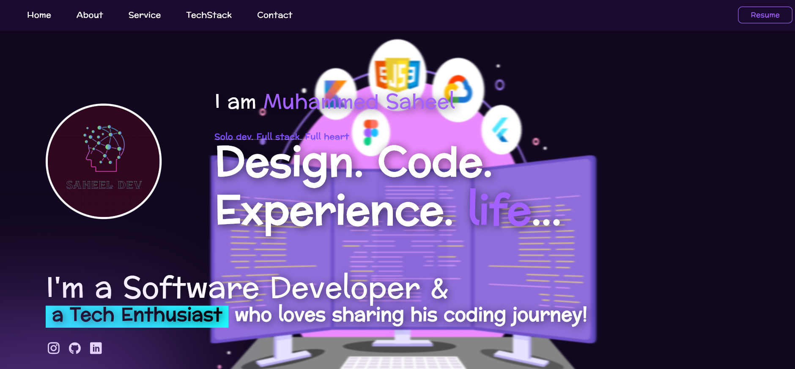

# 👨‍💻 Muhammed Saheel — Flutter Portfolio

Hey there! 👋  
Welcome to my personal **Flutter Web Portfolio**, crafted with 💙 using Flutter.  
This is where I showcase my skills, projects, and everything that makes me *me* as a dev.



---

## 🚀 Features

- 🌐 Flutter Web-powered responsive design
- 💼 Projects, Services, and Tech Stack showcase
- 🎨 Clean, modern UI with bold design
- 🔗 Hosted on Firebase

---

## 🛠️ Built With

- Flutter
- Dart
- Firebase Hosting
- Git & GitHub

---

## 📸 Screenshot Preview

| Home Page |
|-----------|
|  |

---

## 🧪 Getting Started

To run this project locally:

```bash
git clone https://github.com/your-username/flutter-portfolio.git
cd flutter-portfolio
flutter pub get
flutter run -d chrome


